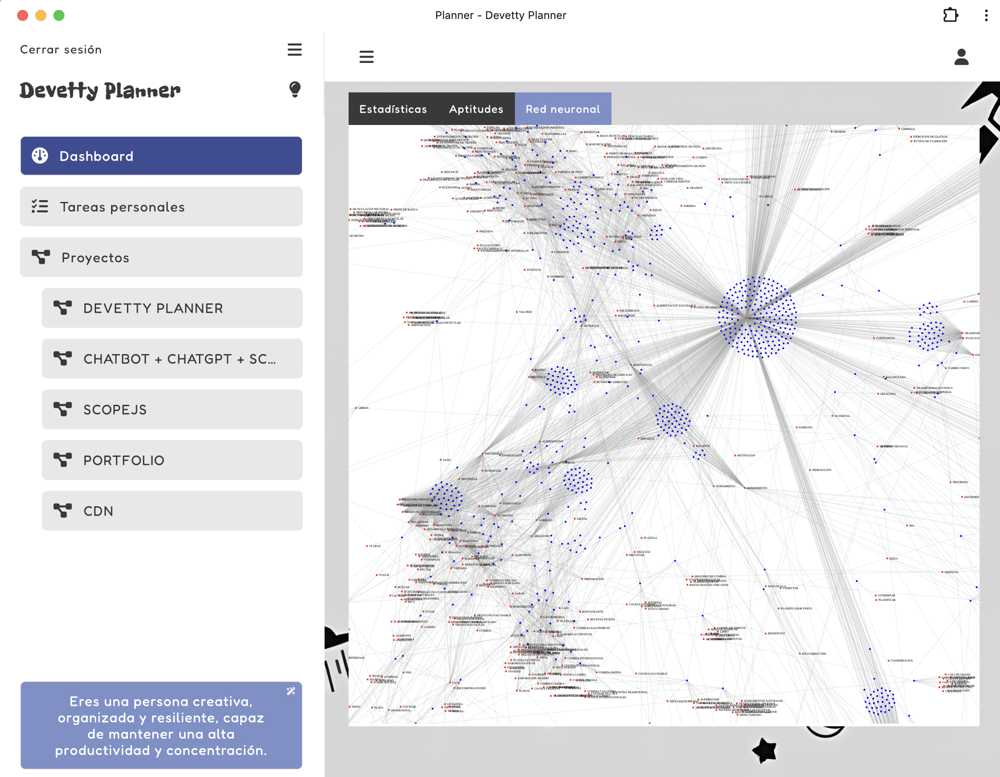
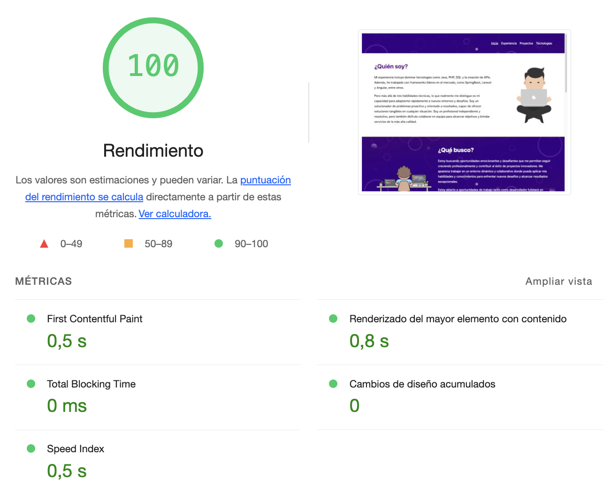

¡Hola! 👋 Soy Pablo

---

**Desarrollador Senior Fullstack** con más de 6 años de experiencia en **JavaScript** y **PHP**, especializado en soluciones escalables y centradas en resolver problemas reales. Estoy abierto a oportunidades de desarrollo fullstack y roles de liderazgo.

---

# A destacar

## Planner

Planner es un planificador de tareas que utiliza inteligencia artificial para ayudarte a organizar tu tiempo de manera más eficiente.

Puedes crear listas de tareas, personales o proyectos, y el sistema de inteligencia artificial te proporcionará sugerencias personalizadas sobre cómo gestionar tu tiempo de la mejor manera.

Red neuronal de Planner en base a tus tareas realizadas

## ScopeJS

ScopeJS es una librería sencilla que permite crear componentes reactivos en JavaScript vanilla. Con ScopeJS, puedes desarrollar aplicaciones web con una arquitectura basada en componentes, lo que facilita la organización y mantenimiento del código.

ScopeJS ofrece una API simple para la creación de componentes reutilizables. El componente básico se define utilizando la función Component, que acepta un objeto de configuración con opciones como el nombre de la etiqueta HTML asociada al componente, un controlador para la lógica del componente y una función de renderizado.

Rendimiento de una aplicación hecha en ScopeJS

---

## 📂 Contenidos

1. [Sobre Mí](#sobre-mí)
2. [Habilidades](#habilidades)
   - [Desarrollo de Software](#desarrollo-de-software)
   - [Lenguajes de Programación](#lenguajes-de-programación)
   - [Frameworks y Bibliotecas](#frameworks-y-bibliotecas)
   - [Herramientas y Entornos](#herramientas-y-entornos)
3. [Experiencia Profesional](#experiencia-profesional)
4. [Proyectos Personales](#proyectos-personales)
   - [ScopeJS](#scopejs)
   - [FormJS](#formjs)
   - [StateJS](#statejs)
   - [Planner](#planner)
   - [Chatbot](#chatbot)
   - [Dink](#dink)
   - [AutoClassJS](#autoclassjs)
   - [Auth](#auth)
   - [EventJS](#eventjs)
   - [MyGymRoutine](#mygymroutine)
   - [HttpClientJS](#httpclientjs)
5. [Habilidades Personales](#habilidades-personales)
6. [Conectemos](#conectemos)

---

## 👋 Sobre Mí

Soy un programador senior con experiencia en **Java**, **PHP**, **SQL**, y en el desarrollo de **APIs**. Me adapto rápidamente y tengo habilidades para liderar y colaborar en equipo, con un enfoque en la mejora continua y la solución de problemas.

---

## 🛠️ Habilidades

### Desarrollo de Software

- **Desarrollo Fullstack**: Front-end y Back-end.
- **Desarrollo de Aplicaciones**: Android e iOS.
- **Desarrollo Multiplataforma**: Soluciones para Web, Móvil y Escritorio.
- **Visión Artificial**: Algoritmos de reconocimiento de objetos y análisis de imágenes.
- **Gestión de Sistemas**: Configuración de redes, servidores y seguridad.

### Lenguajes de Programación

- **JavaScript**: Frontend y Backend.
- **PHP**: Aplicaciones web y APIs.
- **Java**: Aplicaciones empresariales y móviles.
- **SQL**: Consultas y administración de bases de datos.
- **HTML5 & CSS3**: Estructura y diseño web.

### Frameworks y Bibliotecas

- **Frontend**: Angular, React, Vue.js.
- **Backend**: Spring Boot, Laravel, PHP Slim Framework.
- **Multiplataforma**: Next.js, Astro.

### Herramientas y Entornos

- **Control de Versiones**: Git.
- **Metodologías**: Desarrollo ágil y trabajo colaborativo.
- **API REST**: Interfaz de comunicación entre sistemas.
- **Entornos de Desarrollo**: Familiaridad con múltiples entornos y configuración de sistemas.

---

## 👨‍💼 Experiencia Profesional

### Administración Pública

Experiencia en desarrollo de soluciones personalizadas para mejorar la eficiencia, transparencia y accesibilidad de servicios en la administración pública.

### Proyectos Privados

Colaboración en soluciones tecnológicas para startups y grandes empresas, enfocándome en innovación y crecimiento.

### Proyectos Especializados

- **Visión Artificial**: Proyectos de reconocimiento y análisis de imágenes para mejorar la automatización.
- **Desarrollo Web**: Creación de sitios interactivos y aplicaciones dinámicas.
- **Aplicaciones Móviles**: Desarrollo de aplicaciones para Android e iOS, con interfaces intuitivas y optimizadas.

---

## 📁 Proyectos Personales

### Librerias

#### ScopeJS

ScopeJS es una librería que permite crear componentes reactivos en JavaScript Vanilla, facilitando una arquitectura basada en componentes. La API de ScopeJS simplifica la creación de componentes reutilizables mediante la función `Component`, que acepta configuraciones para el nombre de la etiqueta HTML, controlador, y función de renderizado.

[Ver ejemplo y código](https://dink.devetty.es/22b9a0d3-b3a4-408f-84c8-95b849fa7bfa)

#### FormJS

FormJS es una librería ligera de JavaScript para la validación y gestión de formularios. Su API permite añadir validaciones a los campos y obtener los valores como un objeto JavaScript, lo que simplifica el procesamiento y envío de datos.

FormJS es ideal para formularios interactivos y validaciones en proyectos web modernos.

#### StateJS

StateJS proporciona una implementación para gestionar el estado en aplicaciones JavaScript. La librería permite la creación y manipulación de variables de estado con métodos que facilitan el seguimiento de cambios y la actualización de la UI de manera reactiva.

#### Chatbot

Este Chatbot se integra fácilmente en cualquier sitio web y permite interacción dinámica con los usuarios. Utiliza **ScopeJS** y **ChatGPT** para ofrecer una experiencia conversacional útil.

#### AutoClassJS

AutoClassJS permite la generación dinámica de estilos CSS aplicables a elementos HTML mediante atributos personalizados. La librería observa cambios en el DOM y aplica automáticamente clases CSS, facilitando un desarrollo más rápido y limpio.

#### EventJS

EventJS es una librería de JavaScript diseñada para simplificar la gestión de eventos en páginas web, ofreciendo métodos sencillos para escuchar, emitir y detener eventos personalizados.

### HttpClientJS

HttpClientJS es una librería ligera de JavaScript para la realización de solicitudes HTTP, con soporte para métodos **GET** y **POST** y manejadores de respuesta integrados, ideal para interacciones frecuentes con APIs externas.

### Aplicaciones Web

#### Planner

Planner es un planificador de tareas impulsado por IA para organizar el tiempo de manera eficiente. Los usuarios pueden crear listas de tareas personales o de proyectos, y el sistema sugiere cómo gestionar el tiempo basado en prioridades.

#### Dink

Dink es una herramienta de acortamiento de enlaces que convierte URLs largas en direcciones breves y fáciles de compartir en segundos, utilizando tecnología avanzada para garantizar seguridad y disponibilidad continua.

#### Auth

Auth es una pasarela de autenticación que facilita la integración segura en aplicaciones. Permite la autenticación de usuarios y redireccionamiento con un token en el encabezado para garantizar un proceso de inicio de sesión sin problemas.

#### MyGymRoutine

MyGymRoutine ayuda a gestionar y registrar rutinas de ejercicio. Su interfaz permite a los usuarios agregar, editar y visualizar ejercicios asignados por día, lo que facilita el seguimiento del progreso y la planificación de entrenamientos.

---

## 🌐 Habilidades Personales

- **Liderazgo de Equipo**: Experiencia liderando y motivando equipos de trabajo.
- **Trabajo en Equipo**: Colaboración en entornos diversos y multidisciplinarios.
- **Atención al Cliente**: Enfoque en ofrecer soluciones y mantener relaciones basadas en confianza y satisfacción.
- **Trabajo Bajo Presión**: Organización y capacidad de cumplir objetivos en entornos de alta presión.

---

## 📫 Conectemos

- **[Instagram](https://www.instagram.com/pablotheblink)**
- **[LinkedIn](https://www.linkedin.com/in/pablo-mart%C3%ADnez-san-jos%C3%A9-9bb24215a/)**
- **[Portfolio](https://pablomsj.com)**
